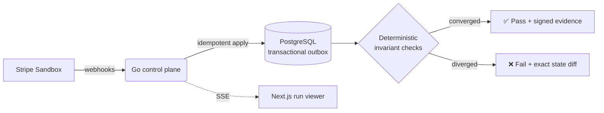

<div align="center">


<a href="https://parity-lab-black.vercel.app/">
  
</a>

<br/>

[](https://parity-lab-black.vercel.app/)
[](go.mod)
[](apps/web)
[](db/migrations)
[](apps/stripe-app)
[](infra/otel)

</div>

---

## The problem

A Stripe integration can return `200 OK` on every request and still be wrong. Webhooks arrive twice. Events arrive out of order. Your endpoint goes down for four minutes during a retry storm. A subscription changes mid-flight. None of that shows up in a happy-path test suite — it shows up as a support ticket, a duplicated charge, or a customer who paid but never got access.

**ParityLab answers a different question than your existing tests do:** not *"did the API call succeed?"* but *"after all the chaos a real payment system throws at you, did your integration end up in the correct state?"*

## How it works

ParityLab runs a deterministic **scenario** — a script of realistic faults (duplicate delivery, reordering, tampering, endpoint outages, concurrent mutations) — against a Stripe integration, then checks whether three independent views of the world agree:



If it converges, you get signed, replayable evidence. If it doesn't, you get the exact point of divergence — not a stack trace, a state diff.

### The invariants that matter

- A run is immutable once it reaches a terminal state.
- A scenario step applies **at most once** per idempotency key — no double-charging on retry.
- Duplicate event delivery can never duplicate a business mutation.
- Event *order* is untrusted; current resource state always wins.
- Live Stripe keys and live-mode events are rejected outright — this is a sandbox-only safety net, not a production proxy.
- Pass/fail is computed deterministically; the explanation layer can describe the result but can never change the score.

## What you actually get

| | |
|---|---|
| 🧪 **Deterministic fault injection** | Same scenario, same seed, same result — every time. No flaky "it passed on my machine." |
| 📡 **Live run viewer** | Watch a verification run happen in real time over Server-Sent Events, not a spinner. |
| 🔍 **Exact divergence, not vague failure** | When something breaks, ParityLab shows *which* invariant, *which* state, *which* step. |
| 🔐 **Signed evidence** | Every run produces a cryptographically signed report you can hand to a reviewer or an auditor. |
| 🧩 **Zero-credential demo** | The full product runs on seeded fixtures — no Stripe account needed to see it work. |
| 🔌 **Real Stripe Sandbox mode** | Point it at real sandbox credentials and it verifies your actual integration, not a mock. |

## Try it live

**[parity-lab-black.vercel.app →](https://parity-lab-black.vercel.app/)**

| Route | What you'll see |
|---|---|
| `/` | The product narrative — an interactive walkthrough of a fault being injected and resolved. |
| `/demo` | A full Story/Explore simulation backed by real, API-created verification runs. |
| `/dashboard` | Live readiness score, findings, service topology, run history, and engine status. |

> The API runs on a free-tier instance and may take ~30–50s to wake up on the first request after idling. That's infrastructure, not the product being slow.

## Architecture

ParityLab is deliberately **self-contained by default** — the full product runs on in-memory fixtures with zero external dependencies, and every piece of "production-shaped" infrastructure (Postgres, Kafka, ClickHouse, observability) is an optional profile layered on top, not a prerequisite for your first `pnpm dev`.

```
apps/
  web/           Next.js 16 product — narrative, simulation, dashboard, SSE run viewer
  stripe-app/    Stripe Dashboard UI extension (drawer view)
services/
  api/
    cmd/paritylab/   Go HTTP control plane — webhook verification, run API, state machine
    cmd/worker/      Durable outbox worker — guarantees at-least-once delivery, exactly-once effect
    internal/        auth · engine · verification · stripeadapter · postgres · secrets · httpapi
packages/
  contracts/     Shared TypeScript ⇄ Go contract types
  ui/            Shared design system
db/migrations/   Versioned, checksum-verified Postgres schema
infra/           docker-compose profiles: Postgres, Redpanda, ClickHouse, OTel, Prometheus, Tempo, Grafana
```

**Stack:** Go 1.26 (control plane + worker) · Next.js 16 / React 19 (product) · PostgreSQL 18 (system of record, transactional outbox) · Stripe Go SDK · OpenTelemetry · pnpm workspaces

## Running it locally

Requirements: **Node.js 24+**, **pnpm 10+**, **Go 1.26+**.

```bash
pnpm install
pnpm dev
go run ./services/api/cmd/paritylab
```

Open `http://127.0.0.1:3000`. The seeded simulation works with zero credentials and automatically upgrades to the real sandbox API once it detects one running at `http://127.0.0.1:8080`.

Want the full infrastructure profile (Postgres, Kafka, ClickHouse, observability)?

```bash
make infra-up      # docker compose: postgres, redpanda, clickhouse, otel, prometheus, tempo, grafana
go run ./services/api/cmd/worker
```

## Testing philosophy

Every layer of ParityLab is tested at the layer where it can fail:

```bash
make verify   # lint + typecheck + unit tests + Go tests + full build, exactly what CI runs
```

- **Contract tests** — the API surface (`api/openapi.yaml`) is verified against the running server, not just documented.
- **Idempotency tests** — duplicate delivery, replayed events, and concurrent mutations are fuzzed, not assumed.
- **Domain tests** — the state machine is tested against every invariant independently of HTTP.
- **Browser/E2E** — the narrative, simulation, and dashboard are tested as a user would actually click through them.

See [`docs/TEST_MATRIX.md`](docs/TEST_MATRIX.md) for full coverage and [`docs/VERIFICATION.md`](docs/VERIFICATION.md) for the exact green evidence from the last verified run.

## Documentation map

| Doc | What's in it |
|---|---|
| [`docs/ARCHITECTURE.md`](docs/ARCHITECTURE.md) | System diagram and the invariants the whole design protects |
| [`docs/HANDOFF.md`](docs/HANDOFF.md) | Verification and infrastructure commands |
| [`docs/VERIFICATION.md`](docs/VERIFICATION.md) | Exact green evidence from the last full verification pass |
| [`docs/security/`](docs/security) | Threat model and security posture |
| [`docs/operations/`](docs/operations) | Runbooks and operational procedures |
| [`api/openapi.yaml`](api/openapi.yaml) | Full API contract |

## Scope, honestly stated

- **Sandbox/test mode only** in v1 — live Stripe keys and live events are rejected by design, not by accident.
- The zero-credential demo is real and complete; connecting real Stripe Sandbox credentials unlocks live verification against your actual integration.
- This documentation never claims a test ran when the required tool or credential wasn't available — if a capability isn't verified, it's stated as unverified.

---

<div align="center">
<sub>Built to answer one question honestly: does your Stripe integration converge, or does it just look like it does?</sub>
</div>
